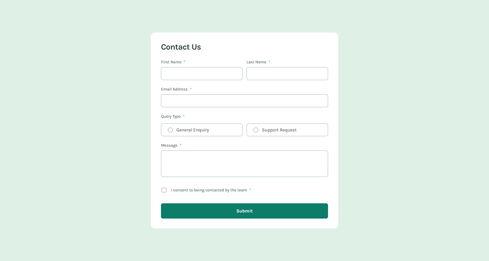

# Frontend Mentor - Contact form solution

This is a solution to the [Contact form challenge on Frontend Mentor](https://www.frontendmentor.io/challenges/contact-form--G-hYlqKJj). Frontend Mentor challenges help you improve your coding skills by building realistic projects.

## Table of contents

- [Overview](#overview)
  - [The challenge](#the-challenge)
  - [Screenshot](#screenshot)
  - [Links](#links)
- [Built with](#built-with)
- [Author](#author)

## Overview

### The challenge

Users should be able to:

- Complete the form and see a success toast message upon successful submission
- Receive form validation messages if:
  - A required field has been missed
  - The email address is not formatted correctly
- Complete the form only using their keyboard
- Have inputs, error messages, and the success message announced on their screen reader
- View the optimal layout for the interface depending on their device's screen size
- See hover and focus states for all interactive elements on the page

### Screenshot

### Links

- Solution URL: [https://www.frontendmentor.io/solutions/semantic-and-responsive-contact-form-using-bem-scss-typescript-kKk1rGxlWm](https://www.frontendmentor.io/solutions/semantic-and-responsive-contact-form-using-bem-scss-typescript-kKk1rGxlWm)
- Live Site URL: [https://fm-contact-form-danil-dikhtyar.netlify.app/](https://fm-contact-form-danil-dikhtyar.netlify.app/)

## Built with

- Semantic and accessible HTML5 markup, using BEM methodology
- Responsive SCSS, including its features, such as partials, variables, mixins, and nesting
- TypeScript, including modules to separate concerns
- Mobile-first workflow

## Author

- Discord - rock_n_roll_crc
- Twitter - [@Rock_n_Roll_CRC](https://x.com/Rock_n_Roll_CRC)
- Frontend Mentor - [@Rock-n-Roll-CRC](https://www.frontendmentor.io/profile/Rock-n-Roll-CRC)
- Codewars - [@Rock-n-Roll-CRC](https://www.codewars.com/users/Rock-n-Roll-CRC)

\

